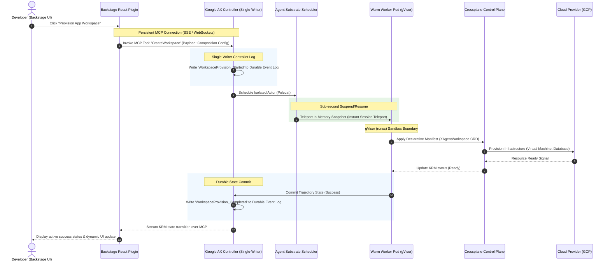

# Architectural Migration: K3s Edge Refactoring with Agent Substrate & Google AX

This document serves as the official blueprint for the "10x" architectural refactoring of the internal Cloud Infrastructure Hub. It details the migration of our edge-deployed K3s control plane to integrate **Agent Substrate** and **Google AX (Agent Executor)**, achieving massive scalability, strict tenant isolation via gVisor, and zero-loss execution recovery.

---

## 1. Executive Summary & Design Goals

At our current operational scale, the lightweight edge-native **K3s** cluster experiences control-plane congestion during heavy developer onboarding, multiple Crossplane provider bootstrappings, and rapid multi-agent executions. 

To overcome these latency and security bottlenecks, we are refactoring our core orchestration architecture around three engineering objectives:
1. **Control-Plane Offloading:** Remove ephemeral and high-chatter agent scheduling from the primary K3s API server and etcd database.
2. **Strict Multi-Tenant Isolation:** Secure all workspace containers and third-party controllers using user-space kernel sandboxing (gVisor `runsc`) with sub-millisecond execution multiplexing.
3. **Durable & Resilient Execution:** Prevent task corruption and deployment failures in unreliable edge environments through single-writer append-only event logs and automatic state recovery.

---

## 2. Platform Architecture Evolution

The refactored system splits responsibilities into three major layers: the **Visual Agentic Cockpit (Backstage)**, the **Distributed Execution Control Plane (Google AX)**, and the **High-Density Sandbox Substrate (Agent Substrate)**.

```
+-----------------------------------------------------------------------+
|                    1. Visual Agentic Cockpit (Backstage)              |
|        - React Component Plugins  - MCP Client Sessions (SSE/WS)      |
+--------------------------------------------------+--------------------+
                                                   | (MCP Stream)
                                                   v
+--------------------------------------------------+--------------------+
|                2. Distributed Execution Control Plane (Google AX)     |
|   - Single-Writer Log Controller      - Active Lease Manager (etcd)   |
|   - Durability Engine (State Logs)    - Tekton/Crossplane State Sync  |
+--------------------------------------------------+--------------------+
                                                   | (Teleport Session)
                                                   v
+--------------------------------------------------+--------------------+
|               3. High-Density Sandbox Substrate (Agent Substrate)     |
|   - Warm Worker Pod Pool              - Instant Session Teleport      |
|   - gVisor (runsc) Sandbox Boundary   - Local Temp FS Snapshotting    |
+--------------------------------------------------+--------------------+
                                                   | (Reconciliation)
                                                   v
+-----------------------------------------------------------------------+
|                4. Infrastructure Control Plane (Crossplane)           |
|        - Unified Declarative API (KRM)  - Cloud Resource Providers    |
+-----------------------------------------------------------------------+
```

---

## 3. Substrate & Crossplane Integration (Bootstrap & Isolation 10x)

### Control-Plane Offloading
Traditional Kubernetes control loops rely heavily on persistent CRD polling and etcd writes, causing etcd write locks and API throttling under high frequency.
* **The Refactored Path:** **Agent Substrate** acts as a sub-scheduler beside K3s. It introduces a lightweight, ephemeral agent session store.
* **Etcd Shielding:** Transient agent operations (such as compiling code, running tests, or polling intermediate cloud states) bypass the K3s API entirely. The K3s API is only contacted once a state-transition is consolidated, reducing etcd writes by up to 90%.

### High-Density Worker Pod Multiplexing
To maintain a small RAM/CPU footprint on edge hardware (such as Raspberry Pi 5), Substrate does not allocate a dedicated K3s Pod per agent session.
* **Warm Pod Pool:** A static, warm pool of K3s worker pods is maintained by the Substrate daemon.
* **Session Multiplexing:** Substrate dynamically instantiates virtual actors (Polecats) within these warm pods. When a task starts, the actor's binary is loaded, run, and terminated inside an ephemeral container layer.

### Sandboxing via gVisor (`runsc`)
Because agents and Crossplane providers execute untrusted code or manage sensitive cloud credentials, they must be rigorously isolated from the host operating system.
* **User-Space Kernel:** All warm Substrate worker pods are assigned the `gvisor` runtime class. The container uses `runsc` to intercept all system calls.
* **System Call Filtering:** The guest kernel inside `runsc` handles filesystem, networking, and memory allocation. It blocks critical operations (like loading kernel modules or editing host interfaces) entirely, preventing container escapes.

### State-Transition Fast-Pathing (Instant Session Teleport)
To avoid standard pod cold-starts, Substrate utilizes high-speed memory and filesystem snapshots:
* **Hibernation:** When an infrastructure task pauses (e.g., waiting for a Crossplane provider to provision an external database), Substrate takes a snapshot of the container's memory and filesystem state.
* **Instant Session Teleport:** The snapshot is written to local flash storage and the container is suspended. When the resource is ready or a new tool call occurs, the session is "teleported" back into a warm pod in under **500 milliseconds**, resuming execution at the exact CPU instruction it paused on.

---

## 4. Distributed Agent Runtime with Google AX

### Durable Execution Engine
Google AX runs as our primary state-transition supervisor, ensuring that long-running developer pipelines (Tekton) and infrastructure operations are fully durable.
* **Event Log Integration:** Crossplane composition states (such as the creation of a workspace, network setup, or compute cluster provisioning) are written directly into AX's append-only event log.
* **Single-Writer Controller Pattern:** To prevent split-brain write conflicts across the edge nodes, a single active AX controller coordinates all logs. It holds a lease backed by K3s etcd. If a worker node drops:
  1. The lease expires and is claimed by another controller node.
  2. The new controller reads the append-only log, reconstructs the agent's exact state, and instructs Substrate to restore the actor snapshot.
  3. The task resumes seamlessly from the last recorded step.



---

## 5. Backstage Front-End Evolution (The 10x UX)

Our Backstage developer portal undergoes a complete paradigm shift, evolving from a static catalog into an active agentic cockpit.

### Decoupling via Model Context Protocol (MCP)
Instead of forcing the Backstage UI to repeatedly query the K3s API server for agent states—which causes API throttling and high CPU overhead—we decouple communications using the **Model Context Protocol (MCP)**:
* **The AX MCP Server:** Google AX hosts an internal MCP server that exposes tools (e.g., `StartAgent`, `HibernateAgent`, `AuditWorkspace`) and resources (live trajectory events and state streams).
* **SSE / WebSockets Transport:** Backstage React plugins establish lightweight, persistent SSE or WebSockets sessions directly to the AX MCP Server.
* **Event-Driven Streaming:** State changes and tool execution outputs are pushed to the frontend in real-time, bypass the K3s control plane, and update the UI instantly with zero API server load.

---

## 6. Implementation & Migration Phases

### Phase 1: Infrastructure Foundations (Complete)
* Configure gVisor (`runsc`) across all K3s master and worker nodes (`sweetsixty6`, `raspberry`, `rpj`, `rpi`).
* Deploy the `RuntimeClass` resource named `gvisor` using the `runsc` handler.
* Automate node installation for future nodes via `setup-gvisor-node.sh`.

### Phase 2: Agent Substrate Configuration
* Deploy the Substrate worker daemon and pool configurations.
* Establish local path volume-claims for quick snapshot storage.

### Phase 3: Google AX Controller Setup
* Deploy the AX Single-Writer Controller lease system and bind it to the durable logging backend.
* Integrate the AX MCP server to serve frontend sessions.

### Phase 4: Backstage Evolution
* Install the MCP React Plugin inside Backstage.
* Connect the UI to the AX stream and verify real-time state visualization.
