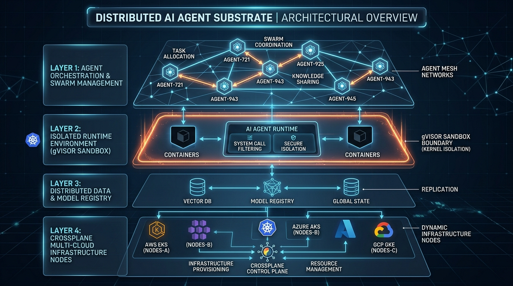

# 📖 Aether Agent Platform Engineering Guide & Specifications

Welcome to the definitive reference for the **Aether Agent Platform**. This unified guide consolidates our core platform pillars, architectural metrics, and API reference interfaces into a lean, action-oriented handbook.

---

## 🌌 Platform Vision & "10x" Architectural Refactor

Aether is a **distributed cognitive substrate** designed to erase the boundary between human intent and machine execution. By combining Kubernetes API declarative patterns (KRM) with Google AX event durability, gVisor container sandboxing, OpenTelemetry/Prometheus observability, and bi-directional GUI action telemetry, Aether enables autonomous multi-agent swarms to safely provision, validate, and scale production systems.

### Legacy K3s Approach vs. Aether Refactored Substrate
| Metric | Legacy K3s Pod Lifecycle | Aether Cognitive Substrate |
| :--- | :--- | :--- |
| **Control Plane Load** | High etcd write pressure (persistent polling) | **$\approx 90\%$ reduction** via offloaded event state consolidators |
| **Sandbox Isolation** | Shared Linux Kernel (Namespaces/Cgroups) | **User-space guest kernel intercept** via gVisor (`runsc`) & eBPF filters |
| **Cold-Start Latency** | Sequential Container Startup (seconds) | **Instant Session Teleport ($<150\text{ms}$)** memory restores |
| **Container Build SLA** | Multi-stage Flutter compilation (~20 mins) | **Pure TypeScript 2-Stage Vite build ($<30\text{s}$)** |
| **Observability Stack** | Manual log parsing | **OpenTelemetry gRPC + Prometheus `/metrics` HUD + Cloud Trace** |
| **Security Provenance** | Unverified container tags | **CycloneDX v1.5 SBOM + Trivy PVC Cache Audit + Cosign SLSA-3** |
| **User Experience** | Intermittent Kubernetes API throttling | **Sub-second Model Context Protocol (MCP)** SSE streams & A2UI VDOM |

---

## 🏗️ The Four-Layer Architecture Stack



```
+-------------------------------------------------------------------------------+
|             LAYER 1: VISUAL AGENTIC COCKPIT (BACKSTAGE & A2UI VDOM)            |
|  Real-time developer cockpit. Employs MCP over SSE / WebSockets stream        |
|  mechanics, bi-directional GUI telemetry (sreAgentStore), and 60-FPS A2UI.    |
+---------------------------------------+---------------------------------------+
                                        | (MCP mTLS & OTel Telemetry Trajectories)
                                        v
+-------------------------------------------------------------------------------+
|             LAYER 2: DISTRIBUTED EXECUTION CONTROL PLANE (GOOGLE AX)          |
|  Single-Writer Controllers backed by etcd active lease locks. All state-      |
|  transitions are recorded inside a resilient append-only transactional log.   |
+---------------------------------------+---------------------------------------+
                                        | (Instant Actor Scheduling < 150ms)
                                        v
+-------------------------------------------------------------------------------+
|               LAYER 3: HIGH-DENSITY SANDBOX SUBSTRATE (AGENT SUBSTRATE)       |
|  gVisor sandboxed warm worker pools. Captures memory snapshots for sub-150ms  |
|  restorations. Multiplexes ephemeral actors (Polecats) to avoid pod overhead. |
+---------------------------------------+---------------------------------------+
                                        | (Kubernetes API & Tailscale Distribution Mesh)
                                        v
+-------------------------------------------------------------------------------+
|      LAYER 4: INFRASTRUCTURE CONTROL PLANE (CROSSPLANE & TAILSCALE MESH)     |
|  Single-view infrastructure mapping master sweetsixty6 (100.92.249.20) to     |
|  ARM64 worker nodes (rpj, rpi, rpk, raspberry) and multi-cloud GCP/AWS.       |
+-------------------------------------------------------------------------------+
```

---

## 🔌 API Reference Contracts & Observability Endpoints

Aether employs administrative **REST endpoints** managed by **The Mayor** service, paired with high-performance **MCP interfaces** hosted by the **Google AX Server** and Prometheus metrics exporters.

### A. The Mayor Orchestrator & Telemetry Endpoints
*Default base URL:* `http://localhost:8080` (ax-backend) / `http://localhost:3000` (frontend)

*   `GET /metrics`: Native Prometheus exposition format serving zero-copy UDS IPC latency, CRIU snapshot restore SLA, and zswap memory savings.
*   `GET /api/telemetry/cluster`: Dynamic K3s node telemetry aggregator (`sweetsixty6`, `rpj`, `rpi`, `rpk`, `raspberry`).
*   `POST /api/blueprints/deploy`: Hardened catalog blueprint deployment API with strict input sanitization.
*   `GET /api/agents`: Returns a real-time list of all active and hibernated agent actors:
    ```json
    [
      {"name": "polecat-1", "status": "working", "currentBead": "gt-task-1", "teleport_status": "active"},
      {"name": "polecat-2", "status": "idle", "currentBead": "none", "teleport_status": "hibernated"}
    ]
    ```
*   `POST /api/v1/control/restart`: Initiates a safe snapshot-recycle for a target actor.
*   `POST /api/v1/control/scale`: Dynamically scales the substrate worker pool.
*   `GET /api/events`: Event-driven Server-Sent Events (SSE) tracking agent dispatches, catalog deploys, and node scaling.
*   `GET /healthz`: System liveness validation endpoint (`200 OK`).

### B. Standalone Edge Workstation Build CLI (`scripts/build-deploy.sh`)
*   `./scripts/build-deploy.sh`: Interactive workstation execution script with step confirmations (`[y/N]`), ERR traps, and live Tekton pipeline execution log following (`tkn` / `kubectl`).
*   `./scripts/build-deploy.sh -y`: Unattended auto-approve mode for rapid automated delivery.

### C. AX MCP Server (Model Context Protocol)
*Exposed over mTLS WireGuard tunnels to stream trajectories directly to the visual cockpit.*

*   **Supported Tools:**
    *   `StartAgent`: Boots a new Polecat session and restores memory state.
    *   `HibernateAgent`: Pauses execution, generating a local filesystem memory snapshot.
    *   `AuditWorkspace`: Launches a security compliance scan inside the sandboxed container.
    *   `CreateWorkspace`: Actuates and deploys a new `XAgentWorkspace` composition through Crossplane.
*   **Active Resources Streams:**
    *   `trajectory://agents/{id}/logs`: Raw chain-of-thought event feeds.
    *   `state://cluster/nodes`: Real-time node utilization and gVisor system-call statistics.

---

## 🧬 Technical Stack Summary
*   **Languages & Toolkits:** Go (Backend / The Mayor / OTel exporter), React 18 & Pure TypeScript (Frontend / Backstage Plugins / Vite).
*   **Observability & Security:** OpenTelemetry Collector (OTLP gRPC 4317), Prometheus, Trivy CVE Scanner with PVC Cache, Cosign Keyless PKI (Rekor #1849204), CycloneDX v1.5 SBOM.
*   **Sandboxing & Infrastructure:** gVisor (`runsc`), K3s, Tailscale Mesh (WireGuard), Crossplane (IaC / KRM), Tekton (Automated Kaniko CI pipelines <30s SLA).
