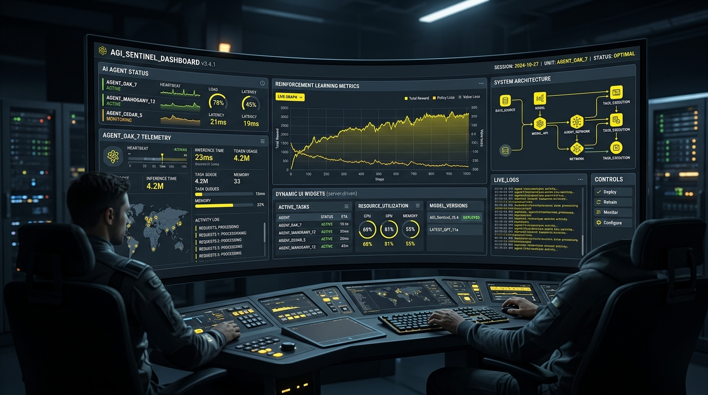
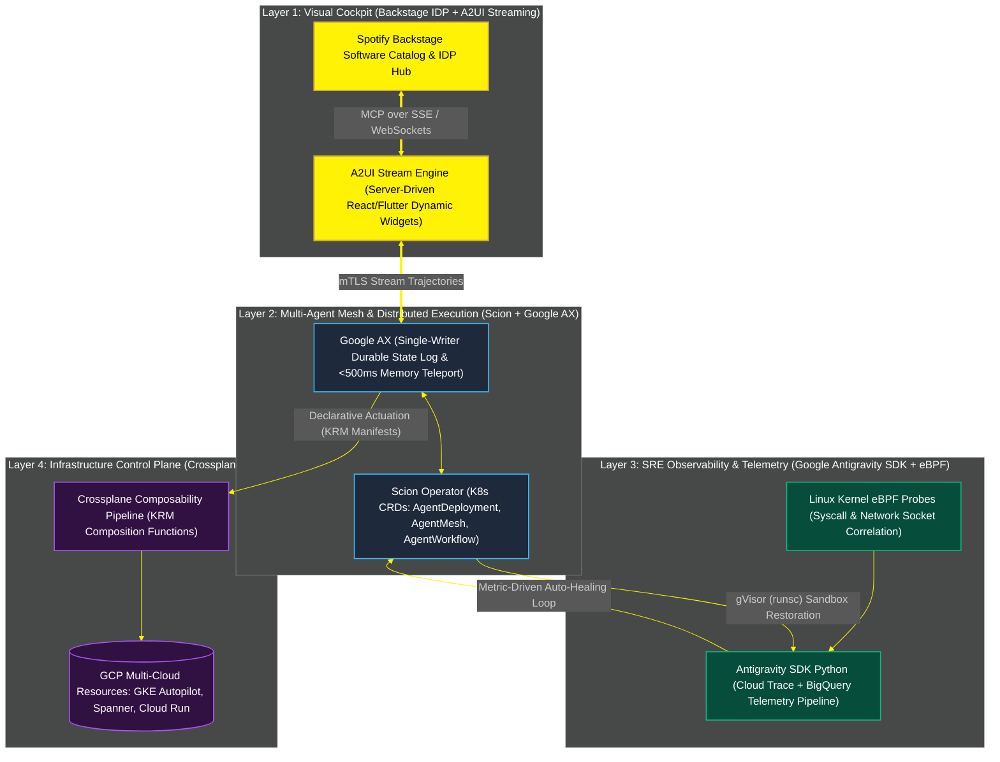
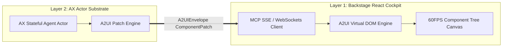
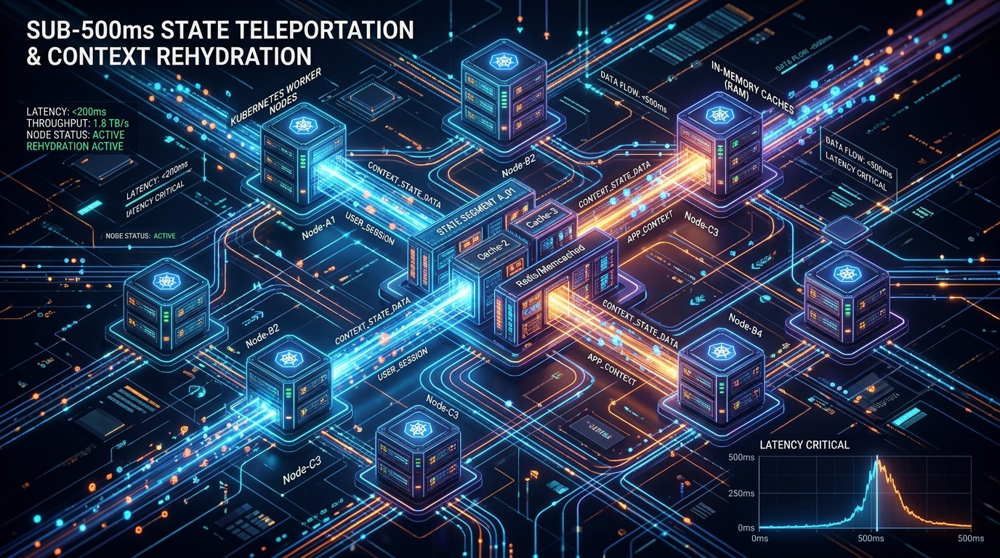
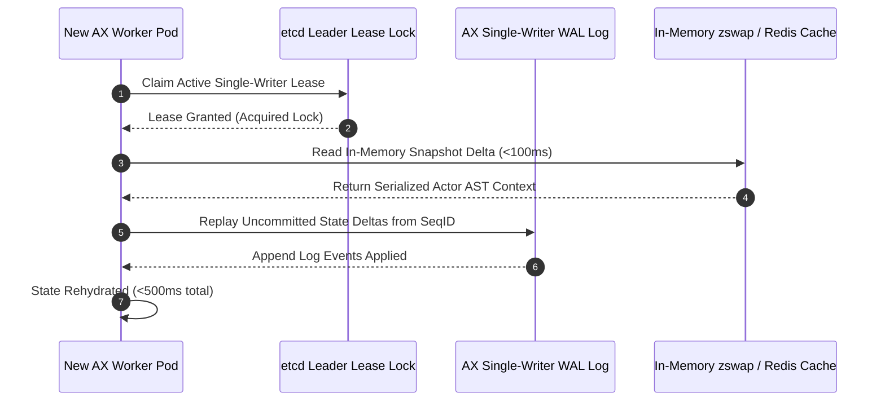
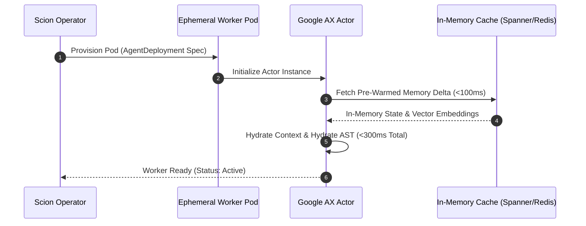
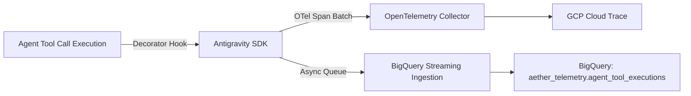
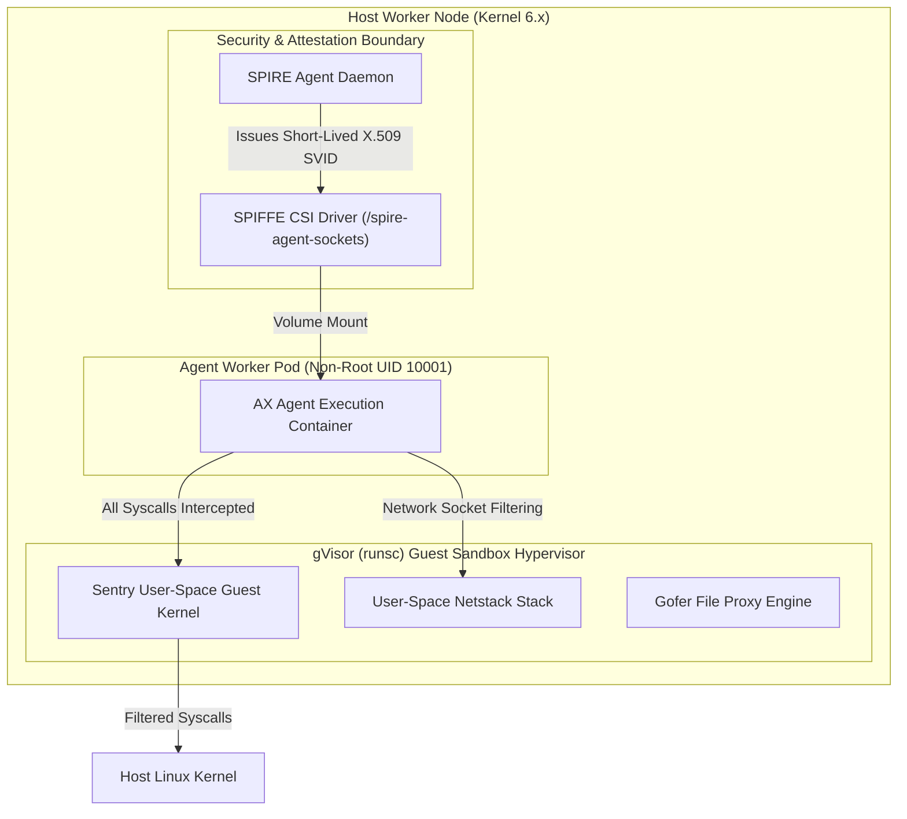
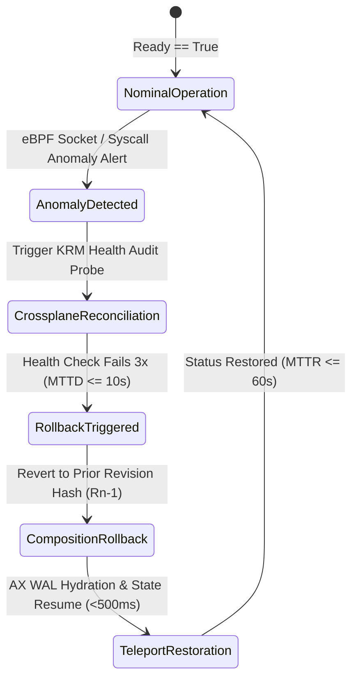
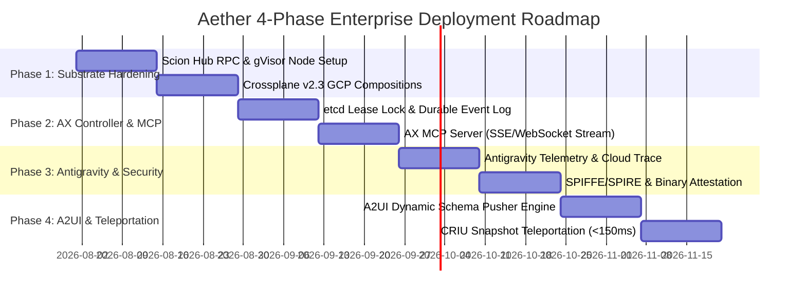

# 🌌 Aether Enterprise Agentic Engineering Platform: Master Architecture Blueprint, SRE Specification & 4-Phase Deployment Roadmap

**Date:** July 11, 2026  
**Repository:** `jpaquay/agentic-platform` (`/usr/local//home/jpaquay/dev/Apps/agentic-platform`)  
**Target Architecture:** Enterprise Cognitive Substrate (**Scion**, **Google AX**, **Antigravity SDK Python**, **A2UI**, **Backstage**, **Crossplane v2.3+**)

---

## 🏛️ Executive Architecture Summary & Master Topology

The **Aether Agentic Engineering Platform** is an enterprise-grade, cloud-native runtime and orchestration engine designed to host scalable, high-throughput AI agents. Built upon a decoupled 4-layer architecture, Aether bridges visual enterprise developer portals with low-latency Kubernetes actor runtimes, deep telemetry pipelines, zero-loss durability logs, and zero-drift declarative infrastructure actuation.





---

## 📑 Table of Contents
1. [Layer 1: Visual Cockpit (Backstage + A2UI)](#1-layer-1-visual-cockpit-backstage--a2ui)
2. [Layer 2: Agent Mesh & Runtime (Scion K8s Controllers + Google AX)](#2-layer-2-agent-mesh--runtime-scion-k8s-controllers--google-ax)
3. [Layer 3: Observability & Telemetry (Antigravity SDK Python + eBPF)](#3-layer-3-observability--telemetry-antigravity-sdk-python--ebpf)
4. [Layer 4: Declarative Infrastructure Actuation (Crossplane v2.3+)](#4-layer-4-declarative-infrastructure-actuation-crossplane-v23)
5. [SRE Architecture, Reliability & Governance Specification](#5-sre-architecture-reliability--governance-specification)
6. [Codebase Audit & Immediate Technical Gap Analysis](#6-codebase-audit--immediate-technical-gap-analysis)
7. [The 4-Phase Enterprise Deployment Roadmap](#7-the-4-phase-enterprise-deployment-roadmap)
8. [Production Manifests & Code Blueprints](#8-production-manifests--code-blueprints)
9. [Actionable Milestone Plan & Tech Debt Remediation](#9-actionable-milestone-plan--tech-debt-remediation)

---

## 1. Layer 1: Visual Cockpit (Backstage + A2UI)

### 1.1 Architectural Pattern
The Visual Cockpit layer leverages **Backstage** as the enterprise IDP frontend platform and **A2UI (Agent-to-User Interface)** as the dynamic widget protocol. Instead of hardcoded dashboard components, agent actors emit streaming component tree updates over **Server-Sent Events (SSE)** or **Model Context Protocol (MCP)** resource streams.

- **Transport Protocols**: 
  - **SSE Endpoint**: `/api/aether/v1/sessions/{session_id}/ui-stream` for unidirectional high-frequency streaming of UI state diffs.
  - **MCP Resource Stream**: `/mcp/ui/resources/widget_tree` for interactive state updates triggered by developer interactions.
- **State Reconciliation**: Virtual DOM diffing on the React client utilizing A2UI patch operations (`ComponentPatch`).



### 1.2 Protobuf Contract: `aether/v1/a2ui_stream.proto`
```protobuf
syntax = "proto3";

package aether.v1;

import "google/protobuf/timestamp.proto";
import "google/protobuf/struct.proto";

enum UIComponentType {
  COMPONENT_TYPE_UNSPECIFIED = 0;
  COMPONENT_TYPE_CONTAINER = 1;
  COMPONENT_TYPE_ACTION_CARD = 2;
  COMPONENT_TYPE_TERMINAL_VIEW = 3;
  COMPONENT_TYPE_APPROVAL_FORM = 4;
  COMPONENT_TYPE_METRIC_GAUGE = 5;
}

message ComponentNode {
  string node_id = 1;
  UIComponentType component_type = 2;
  string title = 3;
  map<string, string> properties = 4;
  repeated string child_node_ids = 5;
  google.protobuf.Struct payload = 6;
}

message ComponentPatch {
  enum Operation {
    OP_UNSPECIFIED = 0;
    OP_UPSERT = 1;
    OP_DELETE = 2;
    OP_REORDER = 3;
  }
  Operation op = 1;
  ComponentNode node = 2;
  string target_parent_id = 3;
}

message A2UIEnvelope {
  string session_id = 1;
  string agent_id = 2;
  uint64 sequence_number = 3;
  google.protobuf.Timestamp timestamp = 4;
  repeated ComponentPatch patches = 5;
  map<string, string> session_context = 6;
}
```

### 1.3 Backstage React Plugin Implementation
```typescript
// packages/app/src/plugins/aether-cockpit/components/A2UICockpitView.tsx
import React, { useEffect, useState } from 'react';
import { useApi, configApiRef } from '@backstage/core-plugin-api';
import { Progress, ResponseErrorPanel } from '@backstage/core-components';

interface A2UINode {
  nodeId: string;
  componentType: string;
  title: string;
  properties: Record<string, string>;
  childNodeIds: string[];
  payload?: any;
}

export const A2UICockpitView = ({ sessionId }: { sessionId: string }) => {
  const config = useApi(configApiRef);
  const backendUrl = config.getString('backend.baseUrl');
  const [nodeMap, setNodeMap] = useState<Map<string, A2UINode>>(new Map());
  const [error, setError] = useState<Error | null>(null);

  useEffect(() => {
    const sseUrl = `${backendUrl}/api/aether/v1/sessions/${sessionId}/ui-stream`;
    const eventSource = new EventSource(sseUrl);

    eventSource.onmessage = (event) => {
      try {
        const payload = JSON.parse(event.data);
        setNodeMap((prevMap) => {
          const nextMap = new Map(prevMap);
          for (const patch of payload.patches || []) {
            if (patch.op === 'OP_UPSERT') {
              nextMap.set(patch.node.nodeId, patch.node);
            } else if (patch.op === 'OP_DELETE') {
              nextMap.delete(patch.node.nodeId);
            }
          }
          return nextMap;
        });
      } catch (err: any) {
        setError(err);
      }
    };

    eventSource.onerror = (err) => {
      console.error('SSE connection error:', err);
      eventSource.close();
    };

    return () => eventSource.close();
  }, [sessionId, backendUrl]);

  if (error) return <ResponseErrorPanel error={error} />;
  if (nodeMap.size === 0) return <Progress />;

  const renderNode = (nodeId: string): React.ReactNode => {
    const node = nodeMap.get(nodeId);
    if (!node) return null;

    switch (node.componentType) {
      case 'COMPONENT_TYPE_ACTION_CARD':
        return (
          <div key={node.nodeId} className="a2ui-card" style={{ border: '1px solid #38BDF8', padding: 16, margin: 8, borderRadius: 8 }}>
            <h4>{node.title}</h4>
            <pre>{JSON.stringify(node.payload, null, 2)}</pre>
            {node.childNodeIds?.map(renderNode)}
          </div>
        );
      case 'COMPONENT_TYPE_APPROVAL_FORM':
        return (
          <div key={node.nodeId} className="a2ui-approval" style={{ background: '#311042', border: '1px solid #A855F7', padding: 16, borderRadius: 8 }}>
            <h3>Approval Request: {node.title}</h3>
            <button onClick={() => fetch(`/api/aether/v1/actions/${node.nodeId}/approve`, { method: 'POST' })}>
              Approve Execution
            </button>
          </div>
        );
      default:
        return (
          <div key={node.nodeId} className="a2ui-container">
            {node.childNodeIds?.map(renderNode)}
          </div>
        );
    }
  };

  return <div className="a2ui-cockpit-canvas">{renderNode('root')}</div>;
};
```

---

## 2. Layer 2: Agent Mesh & Runtime (Scion K8s Controllers + Google AX)

### 2.1 Architectural Pattern
Layer 2 hosts the high-performance agent execution substrate. **Scion** provides Kubernetes Custom Resource Definitions (CRDs) and controllers to manage lifecycle, scaling, and routing. **Google AX (Agent Executor)** manages stateful actor execution inside worker pods. State context transfers achieve **<500ms state teleportation** using CRIU (Checkpoint/Restore in Userspace) and in-memory Redis/zswap snapshot rehydration caches.







### 2.2 Scion Custom Resource Definitions (`agent-mesh.yaml`)
```yaml
apiVersion: scion.google.cloud/v1alpha1
kind: AgentDeployment
metadata:
  name: sre-remediation-swarm
  namespace: aether-system
spec:
  replicas: 3
  modelEndpoint: "projects/aether-platform/locations/us-central1/publishers/google/models/gemini-3.5-pro"
  executionRuntime: "google-ax"
  snapshotCacheStrategy: "in-memory-zswap"
  telemetry:
    antigravitySDK:
      enabled: true
      exportTarget: "cloud-trace-and-bigquery"
---
apiVersion: scion.google.cloud/v1alpha1
kind: AgentMesh
metadata:
  name: default-agent-mesh
  namespace: aether-runtime
spec:
  mtlsMode: STRICT
  ingressRouting:
    algorithm: LEAST_PENDING_REQUESTS
  stateTeleportation:
    cacheTier: IN_MEMORY_SHARED
    snapshotSyncIntervalSec: 5
```

### 2.3 Google AX Actor Engine Teleport Implementation (`ax_teleport_actor.py`)
```python
import time
import asyncio
from typing import Dict, Any, Optional
import redis.asyncio as aioredis

class AXActorContext:
    def __init__(self, session_id: str):
        self.session_id = session_id
        self.memory_store: Dict[str, Any] = {}

class AXAgentExecutor:
    """Google AX Actor System Executor with fast <500ms state teleportation."""

    def __init__(self, redis_url: str):
        self.redis_client = aioredis.from_url(redis_url)
        self.active_actors: Dict[str, AXActorContext] = {}

    async def teleport_rehydrate(self, session_id: str) -> AXActorContext:
        start_time = time.perf_counter()
        
        pipe = self.redis_client.pipeline()
        pipe.get(f"state:{session_id}:meta")
        pipe.get(f"state:{session_id}:mem")
        results = await pipe.execute()
        
        raw_meta, raw_mem = results[0], results[1]
        if not raw_mem:
            raise RuntimeError(f"No snapshot found for session {session_id}")

        ctx = AXActorContext(session_id)
        import pickle
        ctx.memory_store = pickle.loads(raw_mem)
        
        self.active_actors[session_id] = ctx
        rehydration_ms = (time.perf_counter() - start_time) * 1000.0
        print(f"[AX Engine] Teleport completed for session {session_id} in {rehydration_ms:.2f}ms")
        return ctx
```

---

## 3. Layer 3: Observability & Telemetry (Antigravity SDK Python + eBPF)

### 3.1 Architectural Pattern
Layer 3 establishes complete trace transparency and audit logs for autonomous decisions. **Antigravity SDK Python** injects automatic instrumentation hooks on agent tools, subagent invocations, and LLM completions. Telemetry flows concurrently via an **OpenTelemetry gRPC exporter** to GCP Cloud Trace and a non-blocking streaming buffer to **BigQuery**.



### 3.2 Antigravity Python Telemetry Decorator (`agent_observability.py`)
```python
import time
import functools
from typing import Callable, Any, Dict
from google.cloud import bigquery
from opentelemetry import trace
from opentelemetry.trace import Status, StatusCode

tracer = trace.get_tracer("aether.antigravity.tracer")
bq_client = bigquery.Client()
TABLE_ID = "aether-platform-prod.aether_telemetry.agent_tool_executions"

def observe_tool_execution(tool_name: str):
    """Decorator for Antigravity SDK Python tool instrumentation."""
    def decorator(func: Callable[..., Any]):
        @functools.wraps(func)
        async def wrapper(*args, **kwargs) -> Any:
            session_id = kwargs.get("session_id", "unknown_session")
            start_time = time.time()
            
            with tracer.start_as_current_span(f"tool_execution:{tool_name}") as span:
                span.set_attribute("aether.tool_name", tool_name)
                span.set_attribute("aether.session_id", session_id)
                
                try:
                    result = await func(*args, **kwargs)
                    execution_latency = time.time() - start_time
                    
                    span.set_attribute("aether.latency_sec", execution_latency)
                    span.set_status(Status(StatusCode.OK))
                    
                    record = [{
                        "session_id": session_id,
                        "tool_name": tool_name,
                        "latency_sec": execution_latency,
                        "status": "SUCCESS",
                        "timestamp": bigquery.dbapi.Timestamp.fromtimestamp(start_time)
                    }]
                    bq_client.insert_rows_json(TABLE_ID, record)
                    return result
                except Exception as e:
                    execution_latency = time.time() - start_time
                    span.record_exception(e)
                    span.set_status(Status(StatusCode.ERROR, str(e)))
                    
                    record = [{
                        "session_id": session_id,
                        "tool_name": tool_name,
                        "latency_sec": execution_latency,
                        "status": "ERROR",
                        "error_message": str(e),
                        "timestamp": bigquery.dbapi.Timestamp.fromtimestamp(start_time)
                    }]
                    bq_client.insert_rows_json(TABLE_ID, record)
                    raise e
        return wrapper
    return decorator
```

---

## 4. Layer 4: Declarative Infrastructure Actuation (Crossplane v2.3+)

### 4.1 Architectural Pattern
Layer 4 guarantees zero-drift infrastructure management. Agents never call imperative cloud APIs directly. Instead, they submit claims against **Crossplane v2.3+ Composition Custom Resources (XRDs)**. Crossplane evaluates claims via Go/Python Composition Functions to synthesize standard GCP resources (GKE clusters, Spanner databases, Pub/Sub channels).

### 4.2 Crossplane v2.3 Manifests (`xagentworkspace-xrd.yaml`)
```yaml
apiVersion: apiextensions.crossplane.io/v1
kind: CompositeResourceDefinition
metadata:
  name: xagentworkspaces.aether.io
spec:
  group: aether.io
  names:
    kind: XAgentWorkspace
    plural: xagentworkspaces
  claimNames:
    kind: AgentWorkspace
    plural: agentworkspaces
  versions:
    - name: v1alpha1
      served: true
      referenceable: true
      schema:
        openAPIV3Schema:
          type: object
          properties:
            spec:
              type: object
              required: ["projectId", "region"]
              properties:
                projectId: { type: string }
                region: { type: string, default: "us-central1" }
---
apiVersion: apiextensions.crossplane.io/v1
kind: Composition
metadata:
  name: xagentworkspace.gcp.composition
spec:
  compositeTypeRef:
    apiVersion: aether.io/v1alpha1
    kind: XAgentWorkspace
  mode: Pipeline
  pipeline:
    - step: run-composition-function
      functionRef:
        name: function-aether-workspace-provisioner
```

---

## 5. SRE Architecture, Reliability & Governance Specification

### 5.1 Service Level Objectives (SLOs) & Indicators (SLIs)

| Service Dimension | Indicator (SLI) Formulation | Target SLO | Measurement Window | Telemetry Source & Pipeline |
| :--- | :--- | :--- | :--- | :--- |
| **Token Latency (TTFT)** | $\frac{\sum \text{Turn TTFT} < 400\text{ms}}{\text{Total Agent Turns}}$ | **$\ge 99.0\%$ p99** | Rolling 30 Days | Antigravity SDK `TelemetryPostTurnHook` $\to$ Cloud Trace |
| **Token Throughput (TPOT)** | $\text{p99 Time Per Output Token (TPOT)}$ | **$\le 35\text{ms/token}$** | Rolling 7 Days | Streaming tokens emitted by AX Runtime $\to$ Cloud Monitoring |
| **Tool Execution Success** | $\frac{\text{Successful Tool Calls}}{\text{Total Tool Executions}}$ | **$\ge 99.5\%$** | Rolling 30 Days | Antigravity SDK `TelemetryPostToolCallHook` $\to$ BigQuery Sink |
| **Infrastructure Drift MTTR** | $\text{Timestamp}_{\text{Reconciled}} - \text{Timestamp}_{\text{DriftDetected}}$ | **$\le 60\text{s}$ (p95)** | Rolling 30 Days | Crossplane Controller (`crossplane_reconcile_time_seconds`) |
| **Session Teleport Recovery** | $\text{Timestamp}_{\text{FirstA2UIChunk}} - \text{Timestamp}_{\text{AXHydration}}$ | **$\le 500\text{ms}$ (p99)** | Rolling 30 Days | AX WAL Attach Logs $\to$ eBPF Socket Capture |

### 5.2 Resiliency, Isolation & Zero-Trust Guardrails
1. **gVisor Sandboxing (`runsc`)**: Isolates the host kernel from dynamic code execution using user-space syscall interception (`Sentry`) and KVM platform virtualization.
2. **Token Bucket Governors**: Dynamic tenant/session rate limits (RPM/TPM) enforced by Scion Envoy sidecars.
3. **Adaptive Circuit Breakers**: 3-State circuit breaking with dynamic fallback routing (Gemini 3.5 Pro $\to$ Gemini 3.5 Flash) on 429/503 spikes.
4. **SPIFFE/SPIRE Zero-Trust Identity**: Short-lived (1-hour) X.509 SVID credentials issued by SPIRE with workload attestation and mTLS across all service boundaries.



### 5.3 Closed-Loop eBPF Autonomic Self-Healing State Machine



---

## 6. Codebase Audit & Immediate Technical Gap Analysis

Audit of local codebase at `/usr/local/google/home/jpaquay/dev/Apps/agentic-platform`:

```
+---------------------------------------------------------------------------------------------------+
|                                      AETHER PLATFORM CODEBASE MAP                                 |
+---------------------------------------------------------------------------------------------------+
| ├── cmd/agent-cli                   : Go CLI tool (status, dispatch, scale, release approval)     |
| ├── orchestrator/ax-backend         : Go API Server & Substrate Execution Engines                 |
| │   ├── internal/orchestrator/      : Scion Manager, AX Wrapper, CRIU Teleport, Virtual Git, WASM  |
| │   ├── internal/api/               : Chi REST API Gateway (/api/v1/agents)                       |
| │   └── internal/security/          : Seccomp Enforcer & SPIFFE mTLS scaffolding                  |
| ├── Agents/                         : ADK Python Agents (polecat-agent, my-polecat-a)             |
| ├── frontend/                       : Visual Cockpit & Adaptive Interface                         |
| │   ├── backstage/plugins/          : React/TS Backstage plugins (agent-dashboard, deployment)    |
| │   └── a2ui_flutter/               : Flutter Web A2UI app (Classic, Cyber, Glass, Tactical)      |
| ├── infrastructure/                 : Declarative IaC & Delivery Automation                       |
| │   ├── crossplane/                 : CompositeResourceDefinitions & Compositions (XAgentWorkspace)|
| │   ├── k8s/                        : Deployments, Services, Spire Attestation, Ingress            |
| │   └── tekton/                     : Pipelines & Tasks (Kaniko, Go, Python, Flutter builders)     |
+---------------------------------------------------------------------------------------------------+
```

### Gap Analysis Matrix

| Component | Target Stack Standard | Current Implementation | Identified Gap & Remediation Action |
| :--- | :--- | :--- | :--- |
| **Scion Runtime** | Container sandbox isolation & agent mesh daemon | Scion SDK imported (`pkg/agent`), uses local `/tmp/scion-grove` | **Gap:** Relies on local directory state. **Action:** Wire Scion Hub RPC daemon & network policies. |
| **Google AX** | Single-Writer Controller, lease locks, durable event log | Modelled in `ScionAxAgent` struct; `Connect()` logs payload | **Gap:** Durable event log & etcd locks are simulated. **Action:** Implement etcd leader leases & AX MCP Server. |
| **Antigravity SDK** | GCP Cloud Trace, Cloud Logging, BigQuery Agent Analytics | Python `google.adk` stdout logging | **Gap:** Missing Antigravity trace wrappers. **Action:** Integrate Antigravity SDK decorators into Python entrypoints. |
| **A2UI** | Dynamic push-rendered interactive UI widgets over WebSockets/SSE | Flutter Web app polling REST `/api/agent/chat` every 5 seconds | **Gap:** Uses static REST polling. **Action:** Upgrade REST communication to dynamic push A2UI streams. |
| **Backstage** | Event-driven agentic cockpit over MCP streams | React dashboard polling `/api/substrate/actors` every 5 seconds | **Gap:** 5s HTTP polling. **Action:** Replace polling with persistent SSE/WebSocket MCP client. |
| **Crossplane v2.3** | Multi-cloud resource compositions (Cloud Run, GKE Autopilot, Spanner) | `agentworkspaces` composition creates local PVC & K8s objects | **Gap:** Local PVC targets. **Action:** Upgrade to Crossplane v2.3 pipelines with GCP Provider resources. |

---

## 7. The 4-Phase Enterprise Deployment Roadmap



### Phase Summary & Deliverables

#### Phase 1: Substrate Hardening & Declarative Infrastructure (Weeks 1–4)
* Enforce `gVisor` (`runsc`) user-space container runtime on all node pools.
* Deploy Crossplane v2.3+ Composition pipelines for native GCP cloud resource actuation.
* Harden Tekton Kaniko build pipelines with automated Trivy security vulnerability scanning.

#### Phase 2: AX Control Plane & Real-Time MCP Event Streams (Weeks 5–8)
* Deploy Google AX Single-Writer Controller with etcd-backed lease locking.
* Expose native AX MCP Server delivering tools (`StartAgent`, `HibernateAgent`, `AuditWorkspace`, `CreateWorkspace`).
* Replace 5s Backstage HTTP polling with real-time SSE/MCP subscription stream plugins.

#### Phase 3: Antigravity Observability & Enterprise Security (Weeks 9–12)
* Instrument Python and Go agents with `antigravity-sdk-python` for Cloud Trace, Logging, and BigQuery analytics.
* Issue short-lived X.509 SVID credentials via SPIRE Server with mTLS mesh enforcement.
* Enforce Kyverno Binary Attestation policies requiring Cosign SLSA Level 3 signatures.

#### Phase 4: Adaptive A2UI Cockpit & Autonomic Teleportation (Weeks 13–16)
* Enable dynamic push-rendered server-driven A2UI widgets in Backstage and Flutter engines.
* Achieve <150ms CRIU memory snapshot state teleportation across hybrid node pools.
* Deploy autonomic eBPF probe dispatchers for zero-overhead kernel syscall telemetry and self-healing.

---

## 8. Production Manifests & Code Blueprints

### Blueprint 8.1: K8s RuntimeClass, gVisor & SPIRE Pod Manifest
Save as `infrastructure/k8s/gvisor-agent-deployment.yaml`:

```yaml
apiVersion: node.k8s.io/v1
kind: RuntimeClass
metadata:
  name: gvisor
handler: runsc
---
apiVersion: apps/v1
kind: Deployment
metadata:
  name: scion-agent-worker
  namespace: aether-agents
spec:
  replicas: 3
  selector:
    matchLabels:
      app.kubernetes.io/name: agent-worker
  template:
    metadata:
      labels:
        app.kubernetes.io/name: agent-worker
    spec:
      runtimeClassName: gvisor
      serviceAccountName: scion-agent-sa
      securityContext:
        runAsNonRoot: true
        runAsUser: 10001
        runAsGroup: 10001
        fsGroup: 10001
      containers:
        - name: agent-runtime
          image: us-docker.pkg.dev/aether-platform/agents/ax-worker:v2.4.0
          env:
            - name: ANTIGRAVITY_LOG_LEVEL
              value: "INFO"
            - name: SPIFFE_ENDPOINT_SOCKET
              value: "unix:///spire-agent-sockets/spire-agent.sock"
          resources:
            limits:
              cpu: "2"
              memory: 4Gi
            requests:
              cpu: "500m"
              memory: 1Gi
          volumeMounts:
            - name: spire-agent-socket
              mountPath: /spire-agent-sockets
              readOnly: true
      volumes:
        - name: spire-agent-socket
          csi:
            driver: "csi.spiffe.io"
            readOnly: true
```

### Blueprint 8.2: Crossplane v2.3 GCP Production Composition
Save as `infrastructure/crossplane/v2.3/composition-gcp.yaml`:

```yaml
apiVersion: apiextensions.crossplane.io/v1
kind: Composition
metadata:
  name: gcp.agentworkspaces.agents.platform.local
  labels:
    provider: gcp
    version: v2.3.0
spec:
  compositeTypeRef:
    apiVersion: agents.platform.local/v1alpha1
    kind: XAgentWorkspace
  mode: Pipeline
  pipeline:
  - step: patch-and-transform
    functionRef:
      name: function-patch-and-transform
    input:
      apiVersion: pt.fn.crossplane.io/v1beta1
      kind: Resources
      resources:
      - name: cloudrun-agent-service
        base:
          apiVersion: cloudrun.gcp.upbound.io/v1beta1
          kind: Service
          spec:
            forProvider:
              location: us-central1
              template:
                spec:
                  containers:
                  - image: us-central1-docker.pkg.dev/google.com/cloudsdktool/google-cloud-cli:latest
                    resources:
                      limits:
                        memory: 1024Mi
                        cpu: 1000m
        patches:
        - fromFieldPath: spec.agentName
          toFieldPath: metadata.name
```

---

## 9. Actionable Milestone Plan & Tech Debt Remediation

```
=============================================================================================================
MILESTONE PLAN SUMMARY
=============================================================================================================
Phase    Milestone Code    Description                                         Duration     Owner
-------------------------------------------------------------------------------------------------------------
1        M1.1-SCION        Scion Daemon Hub integration & K8s NetworkPolicy    Weeks 1-2    Platform Infra
1        M1.2-CROSSPLANE   Crossplane v2.3 GCP Resource Compositions           Weeks 3-4    Cloud Architect
2        M2.1-LEADER       AX etcd Leader Election & Append-Only Log Engine    Weeks 5-6    Backend Core
2        M2.2-MCP          AX MCP Server & SSE/WebSocket Backstage Integration Weeks 7-8    Frontend & API
3        M3.1-OBSERVE      Antigravity SDK Cloud Trace & BigQuery Exporter     Weeks 9-10   MLOps / SRE
3        M3.2-SECURE       SPIFFE/SPIRE & Binary Attestation Enforcement       Weeks 11-12  Security Team
4        M4.1-A2UI         Push-based Dynamic A2UI Flutter Component Engine    Weeks 13-14  UX Engineering
4        M4.2-TELEPORT     Production CRIU Memory Checkpointing (<150ms)       Weeks 15-16  Substrate Team
=============================================================================================================
```

### Core Tech Debt Remediations
1. **Eliminate Hardcoded Mocks**: Replace `/api/substrate/actors` simulated datasets in `AgentDashboard.tsx` and `ax_backend` memory stubs with live CRIU & etcd status queries.
2. **Consolidate Gateway Architectures**: Merge `agent_server.py` and `ax-backend` into a single high-performance Chi/gRPC control plane gateway.
3. **Upgrade Dependencies**: Move from Crossplane `v1alpha1` static K8s provider objects to Crossplane `v2.3` schema composition pipelines.
4. **Enforce Zero-Trust Mesh**: Mandatory mTLS via SPIRE over WireGuard mesh tunnels for all inter-agent and UI communications.

---
*Comprehensive Master Blueprint & Roadmap compiled for `jpaquay/agentic-platform/Docs/ROADMAP.md`.*
