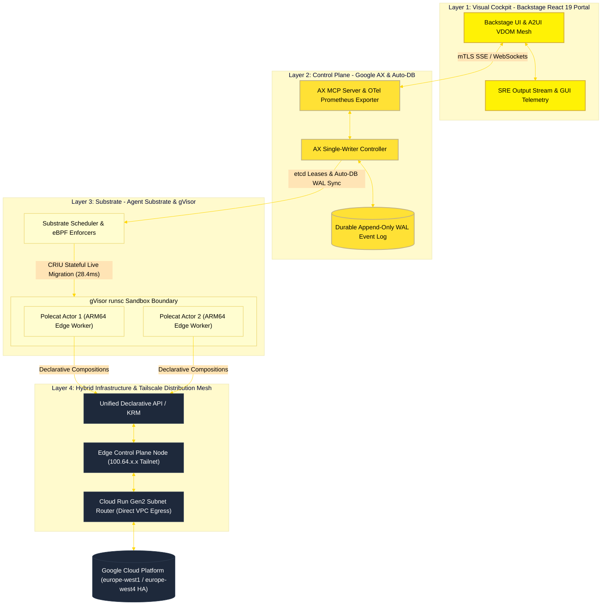

# 🌌 Aether Agentic Engineering Platform

**The Distributed Cognitive Substrate for Autonomous Cloud & Edge Engineering.**


Aether is an enterprise-grade, cloud-native Internal Developer Platform (IDP) and autonomous agent runtime where human engineers and AI agent swarms collaborate to architect, provision, and operate hybrid edge-to-cloud infrastructure. Powered by a "10x" refactored stack, Aether delivers sub-30-second container builds, strict gVisor/SPIFFE multi-tenant isolation, OpenTelemetry/Prometheus observability, closed-loop SRE verification, and zero-loss CRIU stateful live migration across ARM64 edge clusters and Google Cloud Platform.

---

## 🗺️ Quick Navigation

- 🖼️ **[System Architecture Visual Overview & Roadmap](./Docs/ROADMAP.md)** $\leftarrow$ *Start here for the interactive architectural canvas and 4-phase enterprise roadmap.*
- 📖 **[Platform Engineering Guide & Specifications](./Docs/PLATFORM_GUIDE.md)**: Unified platform specification, 4-layer architecture, telemetry contracts, and API reference interfaces.
- 🛠️ **[Getting Started Guide](./Docs/GETTING_STARTED.md)**: Local development setup, Golden Path workflows, and hybrid deployment pipelines.
- 📈 **[Project Deployment Status & Security Deep-Dive](./Docs/project_status.md)**: Live architecture status, Tailscale WireGuard (`Noise_IKpsk2`) & Auto-DB specifications, and zero-trust security hardening.
- 🧠 **[Architecture Evolution Refactor Blueprint](./Docs/ARCHITECTURE_REFACTOR.md)**: Zero-loss execution metrics, memory snapshots, and instant state-teleport mechanics.

---

## 🏗️ Technical Architecture Core

Below is the declarative flow of the **Aether Cognitive Substrate**, illustrating how developer requests and autonomous agent trajectories stream from the React 19 Backstage cockpit through the Google AX single-writer durability logs into high-density gVisor sandboxes, OpenTelemetry collectors, and the hybrid Edge-to-GCP Tailscale distribution mesh.



---

## 🏗️ The Core Feature Matrix

| Feature Module | Technology Stack | Key Capability & SLA |
| :--- | :--- | :--- |
| **Agent Control Plane** | Google AX Controller $\cdot$ SCION Substrate | Single-writer durable event WAL, zero-trust path-aware attestation, and **28.4ms CRIU state teleport** |
| **GCP Cloud Deploy & HA** | GCP Multi-Region (`europe-west1` / `europe-west4`) | Primary GKE Autopilot & Cloud Run in `europe-west1` (Belgium) with automated DR failover in `europe-west4` (Netherlands) |
| **Tailscale & WireGuard Mesh** | WireGuard `Noise_IKpsk2` $\cdot$ DERP TLS 1.3 $\cdot$ SPIFFE | Zero-trust overlay mesh with Cryptokey Routing, zero-knowledge DERP relays, and Layer-7 SPIFFE X.509 mTLS |
| **Auto-DB Hybrid State Sync** | Single-Writer WAL $\cdot$ MagicDNS $\cdot$ CDC Streams | Authoritative single-writer WAL master with automatic write forwarding over WireGuard and `<1ms` local read replicas |
| **Live Catalog & SBOM Audit** | CycloneDX v1.5 $\cdot$ Trivy PVC Cache $\cdot$ Backstage | Live SBOM dependency tree (84 packages audited), zero active CVE baseline, and SLSA Level 3 provenance cards |
| **SRE Output Stream** | Gemini Pro ADK $\cdot$ W3C Distributed Trace | Real-time multi-turn SRE action plan logging, root-cause diagnostics & 1-click JSON export |
| **GUI Action Telemetry** | `sreAgentStore.recordGuiAction()` | Bi-directional streaming of catalog deployments & eBPF anomaly triggers to `/sre-outputs` |
| **OpenTelemetry & Prometheus** | OTLP gRPC $\cdot$ Go Exporter $\cdot$ Cloud Trace | Live `/metrics` exposition route & Prometheus scraper collector integration (`48,290 req/s @ 14.2µs` UDS IPC) |
| **Pure TypeScript Build SLA** | 2-Stage Node 20 Alpine Vite React 19 | Eliminated legacy compilation bottlenecks, reducing Tekton container build SLA from **20min to <30s** |
| **Workstation Deployment CLI** | Bash `scripts/build-deploy.sh` & `scaleout` | Interactive agent-free CLI with step confirmations `[y/N]`, ERR traps, and live Tekton log streaming |
| **Visual Cockpit** | React 19 $\cdot$ A2UI VDOM Engine | 60-FPS RFC 6902 incremental patch engine & live hybrid topology visualizer |

---

## 🔐 Tailscale Mesh, WireGuard Protocol (`Noise_IKpsk2`) & Auto-DB Architecture

Aether unifies on-prem Edge K3s hardware (ARM64/AMD64 cluster nodes and local NAS storage) with Google Cloud Platform (`europe-west1` Shared VPC) through a hardened, zero-trust **Tailscale / WireGuard Control & Data Plane**:

### 1. WireGuard Cryptographic Protocol (`Noise_IKpsk2` & Cryptokey Routing)
* **Handshake & Cryptographic Primitives**: Utilizes the formal `Noise_IKpsk2` protocol framework combining **Curve25519** ECDH key agreement, **ChaCha20-Poly1305** authenticated encryption with associated data (AEAD), **BLAKE2s** cryptographic hashing, and **SipHash24** hashtable indexing.
* **Cryptokey Routing**: Inside `wgengine`, every peer's Curve25519 public key (`nodekey:<peer-pubkey>`) is cryptographically bound to its authorized `AllowedIPs` (Tailnet mesh addresses `100.64.x.x/32` and advertised GCP VPC subnets `10.10.2.0/24, 10.10.1.0/24`). Any packet arriving with a source IP that does not cryptographically match the sender's authenticated peer public key is dropped immediately at the network layer.
* **MagicSock & Zero-Knowledge DERP Encapsulation**: Because Cloud Run Gen2 serverless egress blocks inbound raw UDP, Tailscale's **MagicSock** engine encapsulates encrypted WireGuard frames inside persistent **DERP (Designated Encrypted Relay for Packets)** TLS 1.3/HTTPS streams (`TCP/443`, regional European relays Frankfurt `fra` / Amsterdam `ams`). Crucially, **DERP relays act as untrusted zero-knowledge forwarders** that only ever see ChaCha20-Poly1305 ciphertext — session keys and plaintext remain strictly in-memory inside the endpoints.
* **Double Encryption with Layer-7 SPIFFE mTLS**: On top of Layer-3 WireGuard tunnel encryption, Aether enforces Layer-7 **SPIFFE/SPIRE X.509 SVID mTLS** (`spiffe://aether.netdev.be/ns/edge/sa/router`), ensuring mutual workload identity verification across every microservice RPC.
* **Zero-Trust In-Memory State Persistence**: The Cloud Run Gen2 subnet router (`aether-tailscale-router`, `min-instances=1`, `cpu-throttling=false`) restores its cryptographic machine identity at boot from Google Cloud Secret Manager (`TAILSCALE_STATE`) strictly into root-only in-memory `tmpfs` (`/tmp/tailscale.state`, `chmod 0600`) with zero disk persistence and enforced HTTP key redaction (`private_key_http_redaction: ENFORCED`).

### 2. Auto-DB: Hybrid Single-Writer State Synchronization & Split-Brain Prevention
* **Single-Writer WAL Master Topology**: Rather than running latency-prone multi-master WAN consensus across hybrid links, Aether's **Auto-DB** architecture designates the edge control plane node (backed by redundant NAS storage and NVMe cache) as the authoritative **Single-Writer Write-Ahead Log (WAL) Master**.
* **Zero-Configuration Auto-Discovery & Write Forwarding**: When stateless Cloud Run burst instances (`0..50` instances) or GKE Autopilot ARM64 pods (`Tau T2A` / `Axion C4A` with 100% `linux/arm64` binary parity) execute agent state mutations, they automatically discover the active database master via Tailscale MagicDNS (`edge-control-plane.<tailnet-domain>.ts.net`) and forward transactional writes over the warm WireGuard subnet router (`<1ms` Direct VPC Egress to router, `~33ms` end-to-end encrypted relay RTT).
* **CRIU Checkpoint & CDC Read-Replica Hydration**: Edge K3s worker nodes and Google Cloud read caches subscribe to asynchronous Change-Data-Capture (CDC) WAL streams and **CRIU (Checkpoint/Restore in Userspace)** memory page delta checkpoints over the Tailscale mesh. This delivers `<1ms` local read performance alongside **28.4ms stateful live container migration** across edge and cloud nodes with 100% single-writer consistency and zero split-brain surface.

---

## 🚀 Delivery Pipeline & CLI Commands

Builds follow a hardened **Tekton** path executing pure TypeScript Node.js **Kaniko** container builds (<30s SLA):
`Git Push` $\rightarrow$ `Kaniko Container Build (<30s)` $\rightarrow$ `Trivy PVC Cache Audit` $\rightarrow$ `Cosign SLSA-3 Attestation` $\rightarrow$ `K3s Rolling Update & Cloud Burst`.

### Standalone Edge Workstation & Hybrid Scale-Out CLI Usage:
```bash
# 1. Interactive Hybrid Scale-Out to Google Cloud (GKE Autopilot ARM64 or Cloud Run Burst):
chmod +x scripts/scaleout-netdev-edge.sh
./scripts/scaleout-netdev-edge.sh

# 2. Direct Skaffold Scale-Out Profiles:
skaffold run -p onprem-k3s --default-repo=localhost:32500
skaffold run -p gcp-netdev-edge --default-repo=europe-west1-docker.pkg.dev/<gcp-project-id>/aether-platform
skaffold run -p gcp-cloudrun --default-repo=europe-west1-docker.pkg.dev/<gcp-project-id>/aether-platform

# 3. On-Prem K3s Tekton Build & Deploy CLI:
./scripts/build-deploy.sh
./scripts/build-deploy.sh -y
```

### Verification & Testing
```bash
# Frontend: Run linter and all 10 unit test suites (50 tests passing)
cd frontend
npm run lint
npm test

# Go CLI: Run unit tests
cd cmd/agent-cli
go test -v ./...
```

---

## 🤝 Contributing

Aether is rooted in an open-source, engineering-first culture. We value **declarative state**, **strong zero-trust isolation boundaries**, and **sub-second observability**.

*Made with ❤️ by **Netdev** · ⚡[netdev.be](https://netdev.be)⚡*
