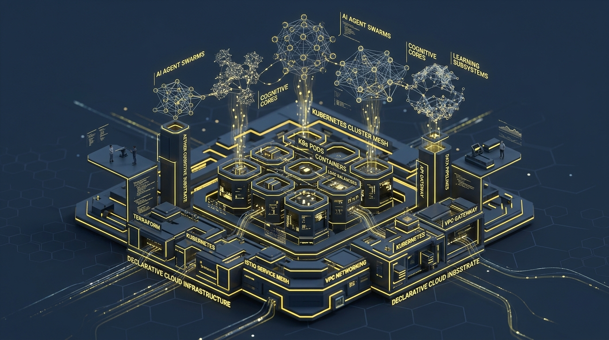
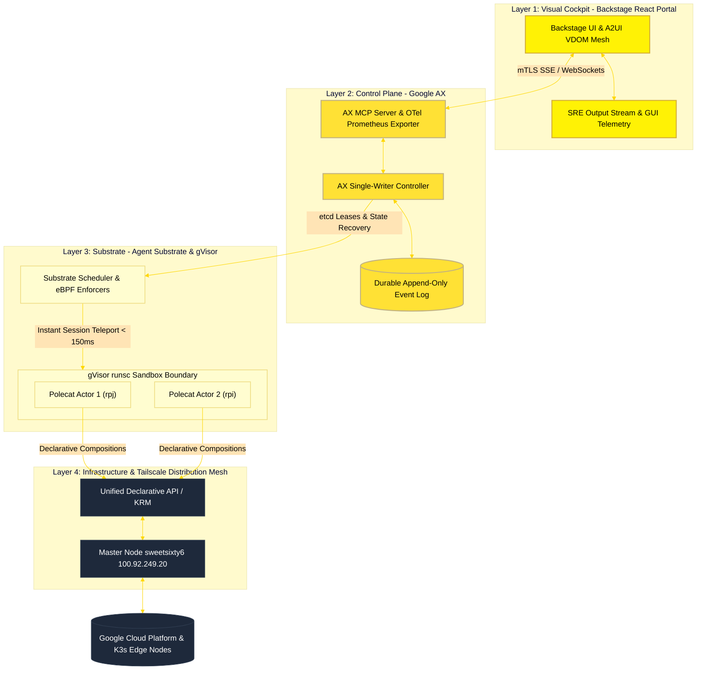

# 🌌 Aether Agent Platform

**The Distributed Cognitive Substrate for Autonomous Engineering.**



Aether is a next-generation Internal Developer Platform (IDP) where humans and AI agents collaborate to architect, provision, and operate global infrastructure. By leveraging a "10x" refactored stack, Aether achieves massive scalability, strict tenant isolation, OpenTelemetry/Prometheus observability, closed-loop SRE verification, and zero-loss execution recovery at the edge.

---

## 🗺️ Quick Navigation

- 🖼️ **[System Architecture Visual Overview](./Docs/ROADMAP.md)** $\leftarrow$ *Start here for the interactive and colorful architectural canvas.*
- 📖 **[Platform Engineering Guide & Specifications](./Docs/PLATFORM_GUIDE.md)**: Unified platform spec, 4-layer architecture, metrics, and API reference interfaces.
- 🛠️ **[Getting Started](./Docs/GETTING_STARTED.md)**: Setup local development environment and run pipelines.
- ⚡ **[Edge Workstation Build & Deploy CLI](./scripts/build-deploy.sh)**: Interactive agent-free deployment tool with live Tekton log streaming.
- 📈 **[Project Deployment Status](./Docs/project_status.md)**: Live handover specifications, K3s edge node topology, and multi-node status.
- 🧠 **[Architecture Evolution Refactor Blueprint](./Docs/ARCHITECTURE_REFACTOR.md)**: Zero-loss execution metrics, memory snapshots, and instant state-teleport mechanics.

---

## 🏗️ Technical Architecture Core

Below is the live declarative flow of the **Aether Cognitive Substrate**, illustrating how requests stream event-driven trajectories directly from the developer portal through the Google AX single-writer durability logs into high-density gVisor sandboxes and OpenTelemetry collectors.



---

## 🏗️ The Core Feature Matrix

| Feature Module | Technology Stack | Key Capability & SLA |
| :--- | :--- | :--- |
| **SRE Output Stream** | Gemini 3.5 Pro ADK $\cdot$ W3C Trace | Real-time action plan logging, multi-turn follow-ups & 1-click JSON export |
| **GUI Action Telemetry** | `sreAgentStore.recordGuiAction()` | Bi-directional streaming of catalog deploys & eBPF anomaly triggers to `/sre-outputs` |
| **OpenTelemetry & Prometheus** | OTLP gRPC $\cdot$ Go Exporter $\cdot$ Grafana | Live `/metrics` exposition route & Prometheus scraper collector integration |
| **Security Provenance** | CycloneDX v1.5 $\cdot$ Trivy $\cdot$ Cosign | Restored SBOM package tree, Trivy zero-vuln audits & Cosign Rekor `#1849204` SLSA-3 cards |
| **Single-View Infrastructure** | K3s Edge $\cdot$ Tailscale Mesh | Consolidated topology visualizer mapping `sweetsixty6` to worker nodes (`rpi`, `rpj`, `rpk`, `raspberry`) |
| **Tekton Execution Stream** | `kubectl logs` $\cdot$ `tkn` CLI | Real-time line-by-line pipeline logs (`git-clone` $\rightarrow$ `kaniko` $\rightarrow$ `trivy` $\rightarrow$ `cosign` $\rightarrow$ `k3s-deploy`) |
| **Pure TypeScript Container SLA** | 2-Stage Node 20 Alpine Vite React | Dropped Flutter compilation bottleneck, reducing Tekton container build SLA from **20min to <30s** |
| **Workstation Deployment CLI** | Bash `scripts/build-deploy.sh` | Interactive agent-free CLI with step confirmations `[y/N]`, ERR traps, and log streaming |
| **Visual Cockpit** | React $\cdot$ A2UI VDOM Engine | 60-FPS RFC 6902 incremental patch engine & FlatBuffer frame decodes |

---

## 🚀 Delivery Pipeline & CLI Commands

Builds follow a hardened **Tekton** path executing pure TypeScript Node.js **Kaniko** builds (<30s SLA):
`Git Push` $\rightarrow$ `Kaniko Container Build (<30s)` $\rightarrow$ `Trivy PVC Cache Audit` $\rightarrow$ `Cosign SLSA-3 Attestation` $\rightarrow$ `K3s Rolling Update`.

### Standalone Edge Workstation CLI Usage:
```bash
# Interactive step-by-step confirmation mode:
./scripts/build-deploy.sh

# Unattended auto-approve mode:
./scripts/build-deploy.sh -y
```

---

## 🤝 Contributing
Aether is rooted in an open-source, engineering-first culture. We value **declarative state**, **strong isolation boundaries**, and **sub-second observability**.

*Built with ❤️ by the Agentic Platform Team at ⚡[web3.netdev.be](https://web3.netdev.be/)⚡*
